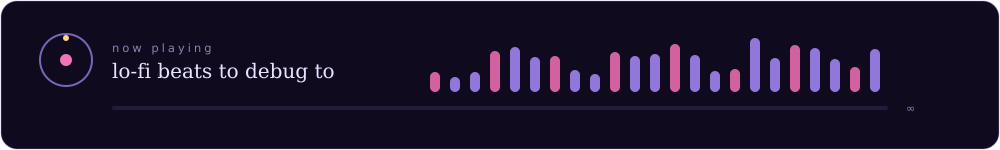

<!--
  PiyushKumar-96 / README.md
  Custom animated SVGs live in ./assets (night, oracle, vibes, aurora, stats, heatmap)
  stats.svg + heatmap.svg are regenerated by .github/workflows/stats.yml
  GIFs are from github.com/Anmol-Baranwal/Cool-GIFs-For-GitHub
-->

 

 

## the short version

Somewhere in Delhi there's a room with the lights off and one monitor on. That's usually me, teaching machines to notice things — hazards in a camera feed, an attack hidden in a prompt, a pattern nobody asked about.

 &nbsp; AI systems, mostly the security and vision kind

 &nbsp; happiest when something runs faster than it has any right to

 &nbsp; will happily talk about lo-fi, latency, or why your regex is haunted

 &nbsp; if it's stupid but it works, it isn't stupid

 

  

 

## things i've conjured

<table>
<tr>
<td width="58%" valign="top">

**IronGuard** — a bouncer for language models. It reads every prompt before your model does and throws out the ones carrying knives: injections, jailbreaks, leaked PII. Went from catching 64% of attacks to 84.8%, and from a 13-second wait to 372 milliseconds.

**VisionX** — spots dangerous objects in a video feed fast enough to matter, on hardware that shouldn't be able to. 93% accuracy, under 100ms, first place at a national hackathon while running on fumes.

**ResumeSnap** — reads a resume the way a tired recruiter wishes they could, then ranks it against the job. Fifteen minutes of squinting becomes ten seconds.

</td>
<td width="42%" valign="top">

</td>
</tr>
</table>

 

## the spellbook

  

 

  

 

## the ledger

this account is young. the constellation is still filling in.

 

## rumours, mostly true

<table>
<tr>
<td width="50%" valign="top">

- explains bugs out loud to nobody, finds them mid-sentence
- has never once closed a browser tab voluntarily
- writes the commit message before the code more often than is healthy
- believes every project deserves one unreasonably nice animation
- sleeps. eventually. usually.

</td>
<td width="50%" valign="top">

</td>
</tr>
</table>

 

## summon me

 

*answers arrive between 11pm and 3am, local time*

